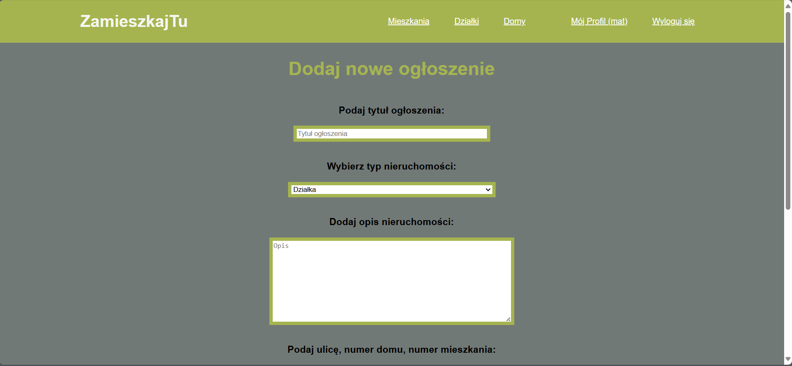

# ZamieszkajTu

ZamieszkajTu to aplikacja internetowa umożliwiająca dodawanie, przeglądanie i zarządzanie ogłoszeniami nieruchomości. 
Użytkownicy mogą rejestrować się, logować oraz dodawać swoje oferty mieszkaniowe, działki i domy.

## Funkcje

- Rejestracja użytkowników
- Logowanie użytkowników
- Dodawanie nowych ogłoszeń
- Przeglądanie dostępnych ogłoszeń
- Edycja i usuwanie własnych ogłoszeń
- Kategoryzacja ogłoszeń na mieszkania, działki i domy

## Technologie

- HTML
- CSS
- PHP
- MySQL

## Wymagania

- XAMPP lub inny lokalny serwer
- Przeglądarka internetowa

## Instalacja

1. Pobierz i zainstaluj [XAMPP](https://www.apachefriends.org/index.html).
2. Sklonuj repozytorium do katalogu `htdocs`:

    ```bash
    git clone https://github.com/MatSki2109/ZamieszkajTu-in-PHP.git
    ```

3. Uruchom XAMPP i włącz Apache oraz MySQL.
4. Utwórz bazę danych o nazwie `zamieszkajtu` i zaimportuj plik `zamieszkajtu.sql` znajdujący się w głównym katalogu.
5. Otwórz przeglądarkę i przejdź do `http://localhost/zamieszkajtu`.

## Użytkowanie

1. Zarejestruj nowe konto lub zaloguj się na istniejące.
2. Dodaj nowe ogłoszenie poprzez formularz dodawania ogłoszeń.
3. Przeglądaj i zarządzaj swoimi ogłoszeniami z panelu użytkownika.

## Zrzuty ekranu

### Strona główna


### Formularz logowania


### Formularz rejestracji


### Panel użytkownika


### Formularz dodawania ogłoszeń




### Lista ogłoszeń


### Pełna oferta


